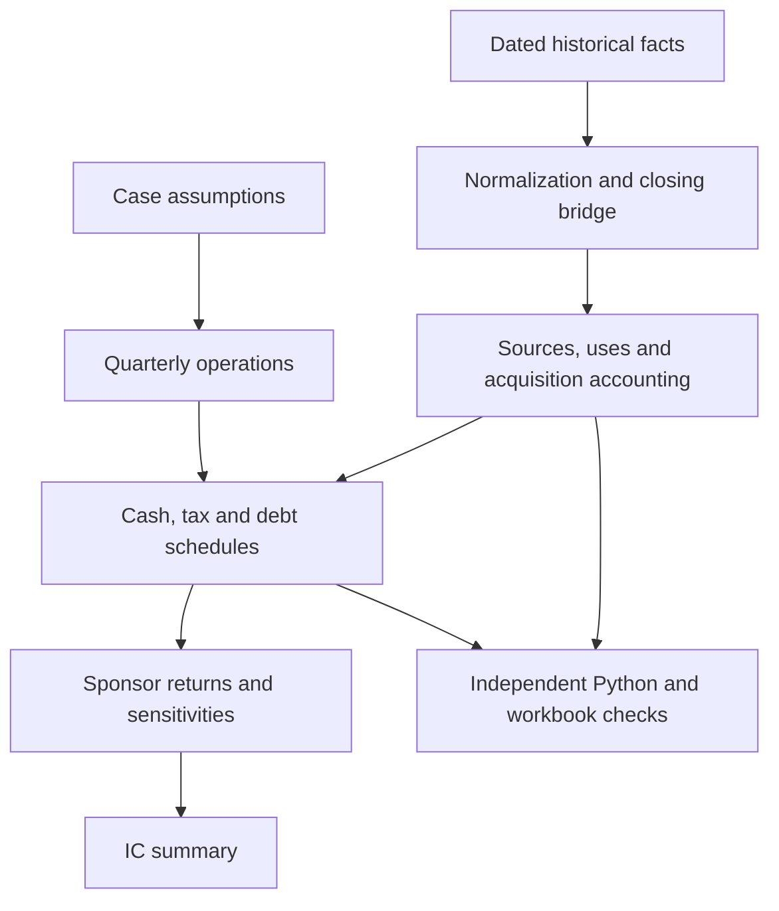

# Mock LBO: Energizer

**Hypothetical practice acquisition. Educational research only. Not transaction, tax, investment or lending advice. No real-money trading.**

A linked Excel acquisition model backed by a separate Python calculation engine. It combines sourced historical financials, an estimated closing bridge, quarterly operating forecasts, acquisition accounting, a debt waterfall, dated sponsor returns and 95 sensitivity combinations.

Information is frozen at **November 30, 2025, 23:59:59 America/New_York**. Hypothetical closing is December 31, 2025; exit is December 31, 2030. Later actual results are deliberately excluded. USD millions throughout unless labeled otherwise.

## Open the model

Download [mock_lbo_energizer.xlsx](excel/mock_lbo_energizer.xlsx) and open it in Microsoft Excel. Start with **IC Summary**, then use **Sensitivities!D5** to select 1 = Base, 2 = Downside or 3 = Upside. Entry and exit multiples are in D6/D7. Rate stress and additional receivable days are in D8/D9. Operating assumptions are on **Assumptions**.

Use Automatic calculation **including data tables**. The workbook has no macros, external workbook links or live market feeds. Blue cells are editable; green formulas link to another sheet. Annual summaries are left of the quarterly detail. Data and methodology are included in the repository.

Excel for Mac is the target application. The model and native sensitivity calculations were tested in the authoring engine and LibreOffice; a hands-on Excel for Mac test remains outstanding. This limitation is recorded, not treated as a passed test. See [validation](docs/validation.md).

## Practice-case results

These are calculated scenario outcomes, **not historical investment performance or forecasts endorsed by the issuer**.

| Metric | Base | Downside | Upside |
|---|---:|---:|---:|
| Sponsor equity invested ($m) | 2,521.5 | 2,521.5 | 2,521.5 |
| Exit EBITDA ($m) | 639.8 | 268.2 | 855.8 |
| Exit debt principal ($m) | 1,434.2 | 2,752.5 | 718.7 |
| Sponsor MOIC | 1.67x | n.a. | 2.71x |
| Sponsor XIRR | 10.7% | n.a. | 22.0% |
| Maximum funding shortfall ($m) | 0.0 | 309.5 | 0.0 |

The base case uses 9.0x entry and exit EBITDA and $534.0m of underwritten entry EBITDA. Downside results become unfunded when cash falls below the minimum despite a fully drawn revolver. Periods after that breach are diagnostic arithmetic, not a financed going-concern forecast. There is no assumed equity cure or refinancing.

## Reproduce on a Mac

Prerequisites: Python 3.12 and Git. All main calculations and tests use the Python standard library. Run from the repository root.

```bash
git clone https://github.com/grisheet/mock-lbo-energizer.git
cd mock-lbo-energizer
python3.12 -m venv .venv
source .venv/bin/activate
export PYTHONPATH="$PWD/src"
python -m mock_lbo.cli validate --case base
python -m mock_lbo.cli validate --case downside
python -m mock_lbo.cli demo --case base --output build/base.json
python -m mock_lbo.cli audit
python -m unittest discover -s tests -v
```

Expected: base XIRR approximately `0.1073321044`, MOIC `1.6653701128`, accounting residuals below `1e-6`, and a successful audit of the saved workbook. The downside reports `feasible: false` and `xirr: null`. The audit compares saved results; it does not pretend to run Excel.

For the pinned development environment, use the committed lockfile:

```bash
uv sync --frozen
uv run pytest -q
uv run ruff check src tests scripts
uv run mypy
uv run mock-lbo audit
```

No API key is required. `.env.example` documents the optional SEC user-agent setting. Do not commit `.env`. JSON logging goes to stderr; result JSON goes to stdout or `--output`. There is no random model component, so no seed is needed.

## What is linked



Sources and assumptions feed builds; checks are terminal observations. Interest uses beginning-of-quarter principal and ACT/360. Cash sweeps occur at quarter-end, avoiding circular calculations. Junior debt is cash-pay and bullet at exit. Finance leases remain outstanding and amortize separately. No dividend recapitalization is modeled.

## Evidence and reproducibility

- [Historical observations](data/historical.csv): 187 numerical facts, definitions and source locations. Fiscal-quarter observations have their actual period-end dates.
- [Source register](data/source_manifest.csv): URLs, CIK/ticker, accessions, publication/retrieval timestamps, rights notes and available source hashes.
- [Assumptions](config/assumptions.toml): hypothetical terms and all three annual operating cases.
- [Methodology](docs/methodology.md): units, signs, formulas, accounting and tax conventions.
- [Investment committee case](docs/investment_committee.md): drivers, downside risks and practice conclusion.
- [Validation](docs/validation.md): executed checks, engine limitations and manual Excel checklist.
- [Milestones](docs/milestones.md): files, commands, expected results and commit messages.

The versioned XLSX is the reproducible Excel template. The offline Python demo and audit are portable and require no proprietary package. This repository does not include a portable generator for rebuilding the workbook's formatting from an empty file. Edit and recalculate the versioned template in Excel, then run the independent audit against the saved file. `uv sync` installs development tools; it does not rebuild the Excel layout.

The two implementations are intentionally separate: Excel contains financial formulas; Python computes the same business logic without evaluating those formulas. Tests compare both and include straightforward cash-flow return baselines.

## Material limitations

This is one selected company, not a strategy backtest. Selection/survivorship bias prevents generalizing its results. There is no machine learning or train/test split.

Purchase accounting and taxes are illustrative. They do not replace valuation work, jurisdictional tax diligence or legal credit documentation. Production-credit receivables and other non-core balances are held flat; no assumed credit monetization funds debt repayment. Retained pension deficits are treated as debt-like claims at entry and exit. Lease balances and pension economics are simplified.

Operating leases are treated consistently as operating costs, not as financial debt in valuation. All existing financial debt is assumed refinanceable at par; actual call premiums and change-of-control terms are not underwritten. Newly drawn revolver debt incurs interest from the next quarter, so the model can understate intra-quarter financing needs. Covenants, cash restrictions, management equity and preferred waterfalls are not modeled.

Source facts are publicly accessible but issuer documents are not relicensed by the code license. See [DATA_LICENSE.md](DATA_LICENSE.md).

## Repository

```text
config/                 Point-in-time settings and assumptions
data/                   Numerical extracts, provenance and workbook map
excel/                  Linked workbook
src/mock_lbo/           Independent financial engine and OOXML audit reader
tests/                  Accounting, financing, return and workbook tests
scripts/                Data export and recalculation-cache utility
docs/                   Methodology, IC case, validation and milestone guide
.github/workflows/      Automated Python checks
```
